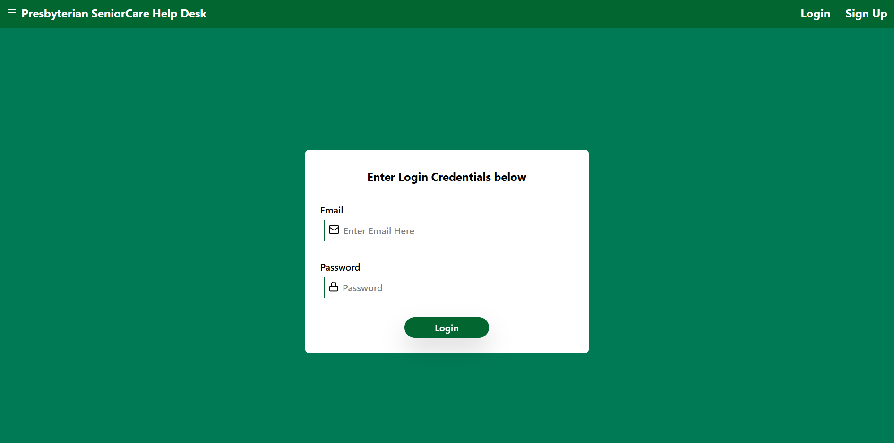
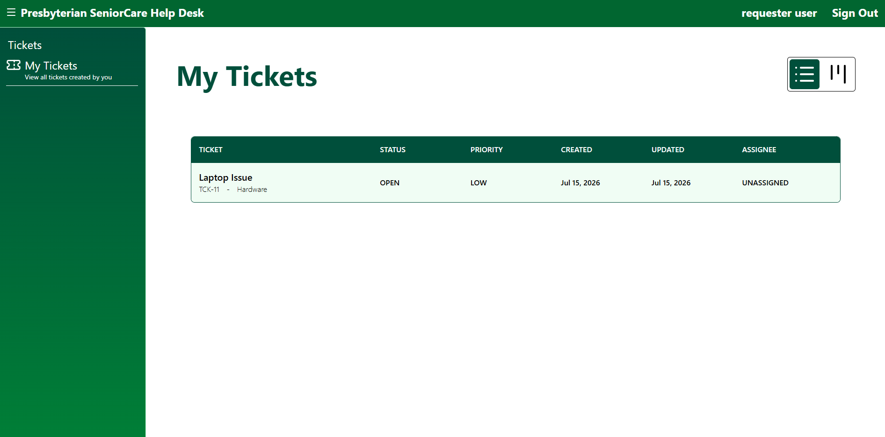
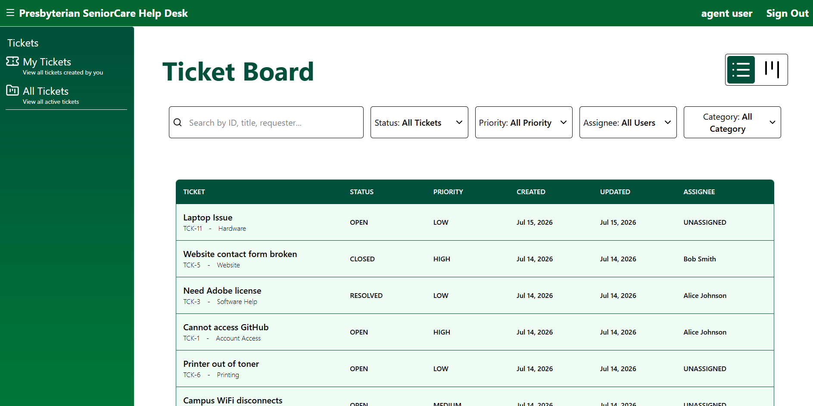
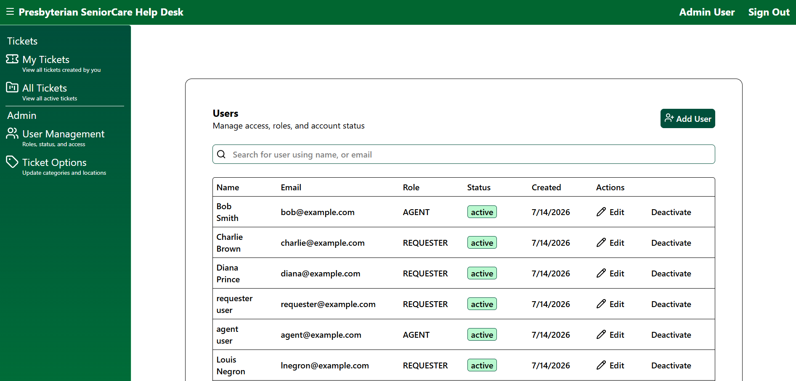
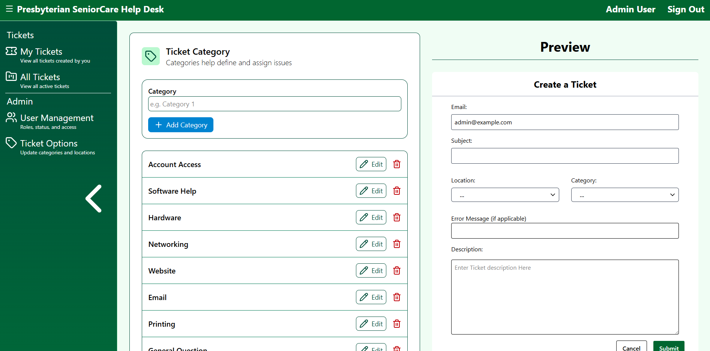
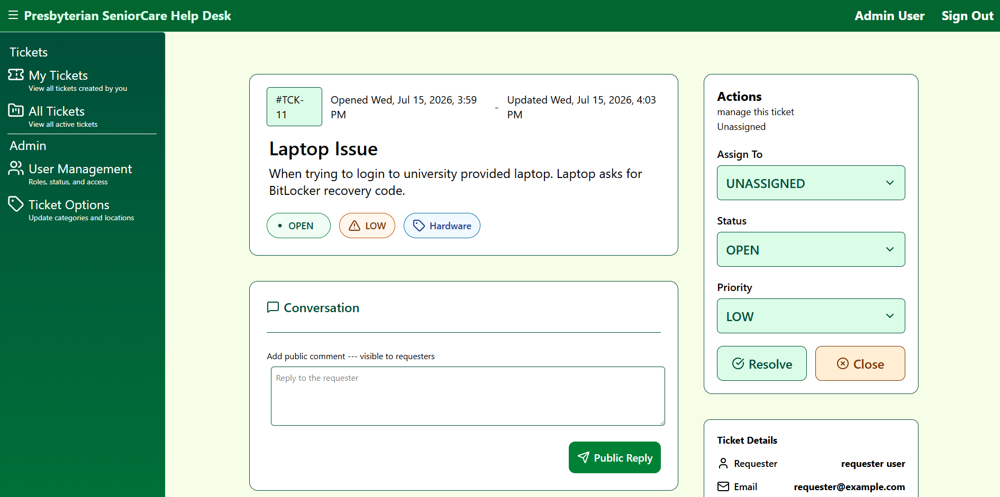
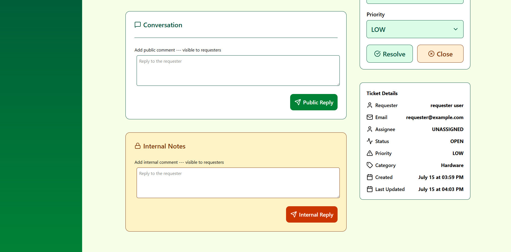

# ServiceDesk

> A full-stack IT service desk application inspired by Freshservice that enables organizations to manage support tickets through role-based workflows.


---

# Table of Contents

- [Overview](#overview)
- [Live Demo](#live-demo)
- [Screenshots](#screenshots)
- [Features](#features)
- [Tech Stack](#tech-stack)
- [Architecture](#architecture)
- [Database Design](#database-design)
- [Authorization](#authorization)
- [API Overview](#api-overview)
- [Project Structure](#project-structure)
- [Installation](#installation)
- [Environment Variables](#environment-variables)
- [Usage](#usage)
- [Testing](#testing)
- [Deployment](#deployment)
- [Future Improvements](#future-improvements)
- [Lessons Learned](#lessons-learned)
- [Author](#author)

---

# Overview

## Motivation

I built ServiceDesk with two primary goals in mind.

First, I wanted to solve a real problem. My help desk previously relied on a basic ticketing process that lacked many of the features found in modern service management platforms. ServiceDesk was created as a more robust and user-friendly solution, providing role-based access control, ticket assignment, comments, activity tracking, and a structured workflow inspired by enterprise tools like Freshservice.

Second, I wanted to deepen my understanding of full-stack software development by building a technically challenging application from the ground up. As the Director of Technical Development for my fraternity, Kappa Theta Pi, it is my responsiblity to mentor and teach new members modern full-stack development practices. I wanted to build this project to better understand the tech stack I would be teaching.

## Description

ServiceDesk is a full-stack IT service management application inspired by modern help desk platforms such as Freshservice. It enables requesters to submit and track technical support tickets, while providing agents with the tools to review, assign, prioritize, and move tickets through a structured workflow. Agents can communicate with requesters through public comments and collaborate internally using private notes.

Administrators have full system management capabilities, including creating and managing user accounts, assigning roles, deactivating users, resetting passwords, and overseeing the overall support workflow. By combining role-based access control, secure authentication, and ticket lifecycle management, ServiceDesk provides a centralized platform for efficiently managing technical support requests.

## Problem Solved

My help desk previously relied on a deprecated ticketing application hosted on an internal webpage. The system was difficult to navigate, poorly organized, and made it challenging for both technicians and users to communicate effectively or keep track of support requests. Finding ticket information, following conversations, and managing the ticket lifecycle required unnecessary effort, leading to an inefficient support experience.

ServiceDesk was built to address these shortcomings by providing a modern, intuitive web application tailored to the needs of our help desk. The application centralizes ticket management with a clean user interface, structured workflows, role-based access control, public and internal messaging, and improved visibility into ticket status and history. The result is a faster, more organized, and more collaborative support process for both requesters and support staff.

---

# Live Demo

**Application:** [ServiceDesk](https://service-desk-three-eta.vercel.app/)

**Backend API:** [Render API](https://servicedesk-c5s8.onrender.com/)

**GitHub Repository:** [GitHub Repository](https://github.com/ChristianGWolff45/ServiceDesk)

---

# Screenshots

## Login

## 

## Requester Dashboard

## 

## Agent Dashboard



---

## Admin User Dashboard

## 

## Admin Ticket Option Dashboard

## 

## Ticket Details




---

# Features

## Authentication & Security

- Secure user authentication using JSON Web Tokens (JWT)
- Protected routes and API endpoints
- Role-based access control for Requesters, Agents, and Administrators
- Password hashing with bcrypt

## Ticket Management

- Create, view, update, and close support tickets
- Assign tickets to support agents
- Track ticket status through a defined workflow
- Set ticket priority and location
- View ticket history and details

## Comments & Collaboration

- Public comments for communication between requesters and agents
- Internal comments visible only to agents and administrators
- Edit existing comments
- Role-based visibility for sensitive information

## User Management

- Create new user accounts
- Update user roles
- Activate and deactivate users
- Reset user passwords
- Manage user information

## Search & Organization

- Search for tickets
- Filter tickets by status, priority, requester, assignee, and location
- Organized dashboards based on user role

## Testing

- Comprehensive backend API testing using Jest and Supertest
- Route authorization and permission testing
- Validation and error handling tests

## Deployment

- React frontend deployed on Vercel
- Express.js backend deployed on Render
- PostgreSQL database hosted in the cloud

# Tech Stack

## Frontend

- React.js
- React Router
- Tailwind CSS

## Backend

- Node.js
- Express.js
- JWT
- bcrypt

## Database

- PostgreSQL

## Testing

- Jest
- Supertest

## Deployment

- Frontend: Vercel
- Backend: Render
- Database: Neon

# Architecture

## High-Level Architecture

<<<<<<< HEAD

=======

>>>>>>> cca4cf3479da39cffbcde1f0e9b81bcd3d43f42d

---

# Database Design

## Entity Relationship Diagram

<<<<<<< HEAD

=======

>>>>>>> cca4cf3479da39cffbcde1f0e9b81bcd3d43f42d

---

# Authorization

| Action              | Requester | Agent | Admin |
| ------------------- | :-------: | :---: | :---: |
| Create Ticket       |    Yes    |  Yes  |  Yes  |
| View Own Tickets    |    Yes    |  Yes  |  Yes  |
| View All Tickets    |    No     |  Yes  |  Yes  |
| Assign Self Ticket  |    No     |  Yes  |  Yes  |
| Assign Other Ticket |    No     |  No   |  Yes  |
| Change Status       |    No     |  Yes  |  Yes  |
| Add Public Comment  |    Yes    |  Yes  |  Yes  |
| Add Internal Note   |    No     |  Yes  |  Yes  |
| Manage Users        |    No     |  No   |  Yes  |

---

# Project Structure

```text
ServiceDesk/
│
├───┐
│   ├── public/
│   ├── src/
│   │   ├── assets/
│   │   ├── components/
│   │   ├── context/
│   │   ├── hooks/
│   │   ├── pages/
│   │   ├── services/
│   │   ├── styles/
│   │   └── utils/
│   └── package.json
│
├── backend/
│   ├── controllers/
│   ├── database/
│   ├── middleware/
│   ├── routes/
│   ├── tests/
│   ├── utils/
│   ├── app.js
│   └── package.json
│
└── README.md
```

---

# Installation

## Clone Repository

```bash
git clone <repository-url>
```

## Backend

```bash
cd backend
npm install
npm start
```

## Frontend

```bash
npm install
npm run dev
```

---

# Environment Variables

## Backend

```env
DATABASE_URL=
JWT_SECRET=
PORT=
```

## Frontend

```env
VITE_API_URL=
```

---

# Usage

## Demo Accounts

### Admin

Email: admin@example.com

Password: password

---

### Agent

Email: agent@example.com

Password: password

---

### Requester

Email: requester@example.com

Password: requester

---

# Testing

## Backend Tests

```bash
npm test
```

---

# Future Improvements

- [ ] File Uploads
- [ ] Email Notifications
- [ ] SLA Tracking
- [ ] Analytics Dashboard
- [ ] Real-time Notifications
- [ ] AI Ticket Categorization
- [ ] Knowledge Base

---

# Lessons Learned

## Biggest Technical Challenges

### Authentication & Authorization

Implementing secure authentication and role-based authorization was one of the most challenging aspects of the project. Designing JWT authentication, protecting API routes, validating user permissions, and ensuring requesters, agents, and administrators only had access to the appropriate resources required careful planning and extensive testing.

### Frontend-to-Backend Integration

Connecting the React frontend with the Express backend taught me how data flows through a full-stack application. Managing asynchronous API requests, handling authentication tokens, updating application state after requests, and debugging communication issues between the frontend and backend helped me develop a much stronger understanding of the request-response lifecycle.

### Backend Testing

Learning Jest and Supertest was another significant challenge. Designing comprehensive tests for authentication, authorization, validation, and edge cases required thinking about the application from the perspective of both expected and unexpected user behavior. Writing these tests greatly increased my confidence in the reliability and security of the API.

## What I Learned

- Design a scalable full-stack application using React, Express, and PostgreSQL.
- Implement secure authentication and role-based authorization using JSON Web Tokens (JWT).
- Design user roles and ticket workflows that enforce business rules through backend authorization.
- Build secure REST APIs with proper validation, error handling, and protected endpoints.
- Connect a React frontend to an Express backend while managing asynchronous data flow and application state.
- Write automated API tests with Jest and Supertest to verify functionality, authorization, and edge cases.
- Deploy and maintain a production-ready application using modern cloud hosting platforms.

## What I'd Improve

- Add backend validation to ensure that submitted category and location IDs exist in the database before creating or updating tickets. Currently, these values are validated on the frontend but are not verified against the database on the backend.

- Expand automated testing to include integration tests against a real PostgreSQL test database in addition to the current mocked API tests.

- Refactor portions of the frontend to improve component reusability and reduce duplicated UI logic as the application continues to grow.

---

# Author

**Christian Wolff**

---

# License

This project is licensed under the MIT License.
